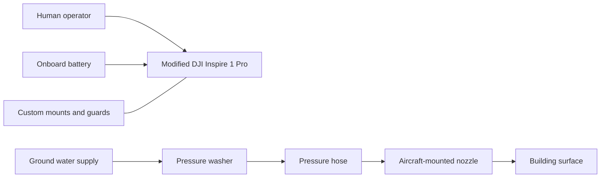

# System architecture

## Initial cleaning prototype

This diagram represents the documented initial arrangement. The historical first-flight record explicitly identifies battery-electric flight. Later electrical tether operation has not been established.

## Separate development stages

| Stage | Evidence | Remaining questions |
|---|---|---|
| Modified Inspire 1 Pro | User attribution, historical test records, cleaning video | Exact firmware, each component revision, flight weights |
| Custom mechanical iterations | Drive CAD exports and design task records | Which revision flew in which session |
| Successor builds | Kian's direct account and reported Fusion designs | Aircraft count, configuration, dates and performance |
| M400 commercial equipment concept | Later parts list and supplier documents | Whether purchased, integrated or flown |

## Proposed capabilities

Historical papers describe electrical ground power, autonomous route execution, building mapping and multi-drone coordination. Those features must be tied to dated implementation and test evidence before being placed in an as-built diagram.

A water hose is not proof of an electrical tether. A planned route is not proof it was executed. A photograph of a component is not a load or endurance test.
