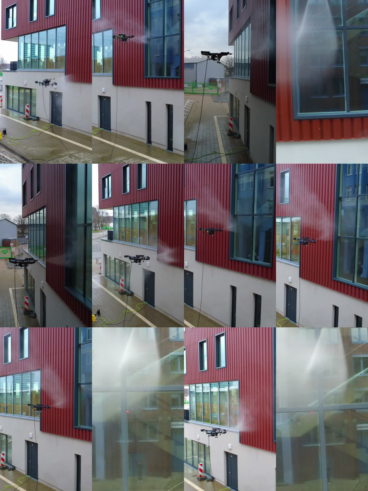

# Flight and test history

This is a session register, not a count of successful flights. Dates below combine original media metadata with written test records. Camera clocks were not independently calibrated and timestamps from different devices can differ by approximately an hour.

| Session | Best-supported date | Evidence and result |
|---|---|---|
| Flight Test 1 | 4 December 2024 | Notion mission date and original video dates agree. Review describes pressure-water flight, nozzle repositioning, hose resistance and guard damage. |
| Flight Test 2 | 15 December 2024 | Notion and media dates agree. Written review says no takeoff because of wind. Record as an aborted test with ground-system observations. |
| Flight Test 3 | 19 December 2024 | Notion and media dates agree. Written post-flight observations exist despite an unchanged “Not started” status. |
| Flight Test 4 | 21 December 2024 | Original video metadata supports this date; Notion mission date is blank. Edited video visibly shows building spraying. Written review records height-holding difficulty, emergency landings and damage. |
| Additional sessions | Unresolved | Kian reports additional flights and autopilot use. Do not assign dates or control modes without matching evidence. |

## Later workshop photography

Twenty photo files, including copies and crops, carry 23 February 2025 EXIF dates. A representative original shows a modified drone held in a workshop. This documents later hardware photography, not a confirmed flight.

## Archive exception

`Flight_4/Discarded/DJI_0019.MP4` carries a 19 December 2024 date. Folder membership therefore cannot establish a flight date. Edited exports made on later days are not new flights.

## What each complete session report needs

- Date and date evidence, including clock/timezone uncertainty.
- Aircraft, component revisions, software and control mode.
- Objective, setup and observed outcome.
- Pilot interventions, aborted segments and damage.
- Original media/log identifiers.
- Lessons and subsequent changes.

The four original written records are partial. Their placeholder schedules and incorrect wind units have not been converted into operational limits. Reported damage causes remain hypotheses unless independently resolved.

## Watch the fourth test flight

[Watch the published 58-second video](https://www.youtube.com/watch?v=VmThMd9uGMc), supplied by Kian as the lead project demonstration. The Vitrobotics channel published it on 1 January 2025. That publication date is separate from the original-camera date reconstruction above.

These sampled frames show spraying in flight. They do not establish the control mode, measured cleaning throughput or a complete flight outcome.
