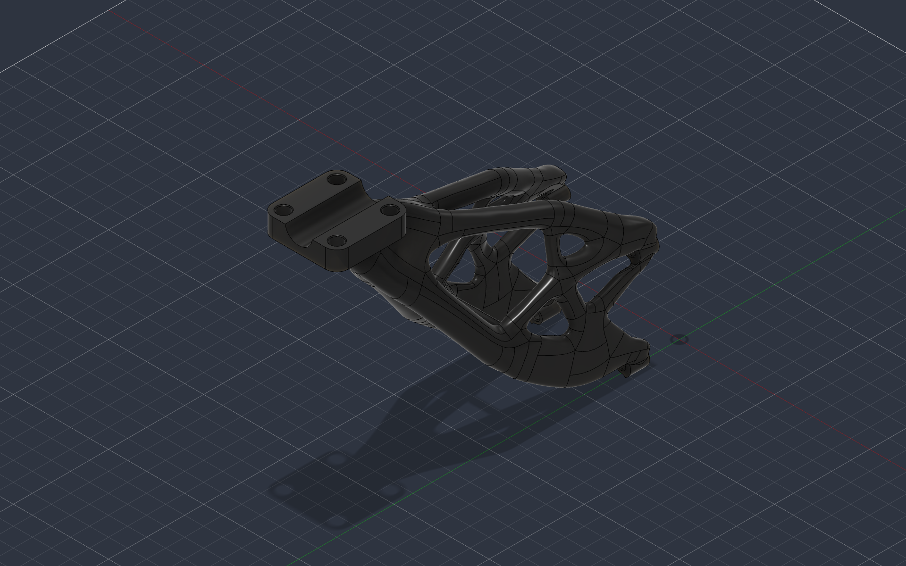

# gd34: designing around the interfaces

**gd34 is our latest generated nozzle-adapter design.** Its native Fusion file connects directly to Study 34 in the original `DJI_Mount_v3` generative project. The study records explain how the branching shape was framed: retain the aircraft and tool interfaces, reserve space for surrounding hardware, then minimize the material connecting them under a defined structural loading case.

[Inspect the geometry](../../hardware/inspection/README.md) · [Nozzle and hose development](nozzle-and-hose.md)

## The design space

The study preserves five bodies and excludes seven. This separates the interfaces that must survive generation from the volumes that the generated material must avoid.

| Role | Original component bodies | Engineering purpose |
|---|---|---|
| Preserve | Four `Inspire_Screw_Mounts` bodies | Retain the aircraft mounting interfaces |
| Preserve | `Bottom_Plate` body | Retain the tool-side attachment interface |
| Obstacle | `Top_Plate` and `Pressuregun` bodies | Keep generated material clear of the adjoining cleaning hardware |
| Obstacle | `Geoblocker` and its four `Screws` bodies | Reserve the defined clearance volumes around the assembly and fasteners |

No starting-shape assignment is recorded for Study 34. The preserved and obstacle bodies define its interface and clearance requirements. Autodesk describes these roles in its [design-space documentation](https://help.autodesk.com/cloudhelp/ENU/Fusion-GenerativeDesign/files/GD-DESIGN-SPACE.htm).

This was a mechanical integration problem as much as a shape-generation exercise. The result needed to connect separate mounting regions while leaving room for the existing tool and fasteners. That combination explains why the interfaces remain regular while the connecting material branches through the available space.

## Structural inputs

Study 34 contains one active case, `Load Case1`. Its support, gravity and force annotation groups are enabled. Directions below use the model's global axes; they are not aircraft navigation coordinates.

| Input | Magnitude and direction | Assigned region |
|---|---|---|
| `Force8` | 100 N per selected face, +Y; four faces | One face on each Inspire screw-mount body |
| `Force9` | 600 N total, −Z | Bottom-plate face |
| `Remote Force2` | 10 N, −Z | Coupled to a bottom-plate face from an offset point |
| `Remote Force3` | 10 N, +Y | Coupled to a bottom-plate face from a second offset point |
| Gravity | 9.80665 m/s², −Z | Case-specific linear acceleration |
| `Fixed3` | Fixed global translations | Selected cylindrical faces on the four screw-mount bodies |

The source project specifies newtons for force display and explicitly distinguishes per-entity loading from a total force. The four 100 N entries therefore represent four assigned forces, not one 100 N force divided between the mounts. Remote loads also depend on their application positions; reproducing the study requires those offsets and the original face selections. See Autodesk's [structural-load guidance](https://help.autodesk.com/cloudhelp/ENU/Fusion-GenerativeDesign/files/GD-APPLY-LOADS.htm).

**These values are study inputs, not a measured load capacity or a record of flight forces.** The archive does not provide a measurement-based derivation for each entered load. A resulting design must be assessed against the intended physical joints, material, loading and manufacturing process before use.

## Material and objective

The study uses the Fusion material **Nylon 12 (with Formlabs Fuse 1 3D Printer)** and a **minimize-mass objective with a target safety factor of 2.0**. That target defines the optimization request; it does not establish an achieved margin for the exported part.

The saved resolution factor is 0.4. Inertial relief and material-reduction-only are disabled. The project contains manufacturing-condition records, but their process types do not identify a selected manufacturing route reliably enough to reproduce it here.

The [earlier adapter slicer setup](nozzle-and-hose.md#preparing-the-adapter-for-printing) uses GreenTec pro CF on a Bambu A1. That is a separate manufacturing record. The Nylon 12 study and the filament print setup describe different material choices, and the study properties cannot be transferred to that printed part.

## Pressure and mount loading

The cleaning system supplies pressurized water to a nozzle, while the adapter carries mechanical loads through its attachments. Study 34 expresses those structural inputs as forces, remote forces and gravity; it contains no pressure-load assignment.

A pressure value describes force per area. Converting it to a load on a bracket requires the actual loaded area and force path. Nozzle reaction also depends on the flow and discharge direction. The structural entries above should therefore not be read as a direct conversion of the pressure-washer rating. Autodesk's [pressure-load definition](https://help.autodesk.com/cloudhelp/ENU/Fusion-GenerativeDesign/files/GD-TERM-PRESSURE-LOAD.htm) explains the distinction between pressure applied to a selected face and a concentrated structural force.

## From study to component

The native gd34 result retains its link to Study 34, and the exported geometry makes the resulting form inspectable. Earlier gd11 and gd21 alternatives remain part of the adapter development history. File naming alone does not establish a quantitative improvement between alternatives.

The next comparison requires outcome metrics and a match to the manufactured revision: finished mass, displacement, stress, manufacturing material and the installed test configuration. The current record establishes the original design setup and geometry without presenting an optimization target as a measured result.
