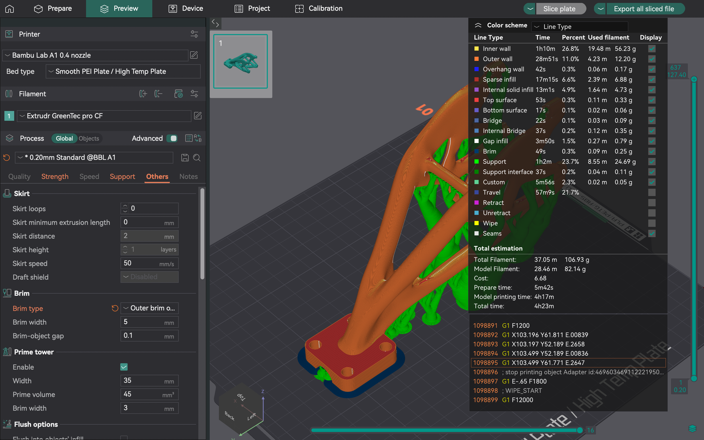

# Bringing water to the aircraft

The first cleaning prototype combined a DJI Inspire 1 Pro with a ground-fed pressure washer, a hose and an aircraft-mounted nozzle. Drone Masters Academy sponsored the aircraft. We designed the attachments around it and tested the cleaning system at our headquarters, Factory Hammerbrooklyn in Hamburg.

The nozzle adapter had a straightforward job: position the cleaning tool beside the aircraft and hold it in place. The hose made that problem more demanding. Its position and resistance changed as the aircraft moved, so the adapter, hose fixation and aircraft had to work together.

## Adapter development

We explored branching adapter shapes through topology optimization and generative design, then prepared them for additive manufacturing. The design files include `gd11_s1m1.3mf`, `gd21_v1.3mf` and `gd34.3mf`. Separate parts include `top_plate.3mf`, `Hose_Holder_v2.3mf`, and the MK2 brackets `Bracket_1.3mf` and `Bracket_2.3mf`.

These files cover the nozzle attachment and hose support as separate component families. The original Fusion studies will add the design constraints and the reasons for selecting particular alternatives; the current documentation covers the exported geometry and print preparation.

## Preparing the adapter for printing

*The saved November 2024 print-preparation view. Material and time figures are slicer estimates.*

The November 2024 adapter print setup used a Bambu Lab A1 with a 0.4 mm nozzle, Extrudr GreenTec pro CF filament and a 0.20 mm profile. The branching geometry required support material, which added to the material and time needed to produce the part.

The saved slicer view, `Screenshot 2024-11-20 at 10.00.15.png`, estimated **82.14 g of model filament**, **106.93 g total filament** and **4 h 23 min** of printing. Those figures describe the print setup. Finished-part mass and mechanical performance are not included in this record.

## What changed after flying

The first test led to changes in nozzle position and a redesign of the hose fixation. Hose resistance increased as the aircraft climbed, making hose management an important part of the attachment design.

By Flight 4, the prototype was spraying the building's windows and façade in flight. The video `Aeroshine_Flight_4_v2.0.0.mp4` shows the aircraft, hanging hose and directed spray together. The initial aircraft used onboard batteries; the hose supplied water.

The next part of this design history is to match each adapter and hose-holder revision to its installed configuration. That will connect the generated alternatives, manufactured parts and changes made between tests without confusing a design iteration with a new aircraft.

See the [flight history](../flights/README.md) and [CAD register](cad-register.md) for the wider development record.
