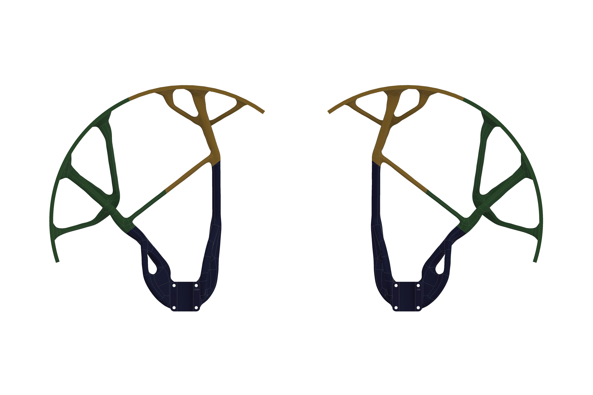

# Propeller guards

Flying a cleaning aircraft beside a building put rotor clearance and attachment stability at the centre of the mechanical design. We developed custom guards with separate clockwise and counter-clockwise versions, using topology optimization and generative design to explore their form.

The guard was an assembly: an outer ring, branching ribs, mounting brackets and plates. Designing those interfaces was as important as designing the ring itself.

## Geometry and revisions

*CAD view of the paired guard designs, with three coloured segments.*

The v1, v2 and v2.1 families preserve several iterations of the guards. The later versions use three-part exports: `Prop_Guard (1).3mf`, `Prop_Guard (2).3mf` and `Prop_Guard (3).3mf`, with CW and CCW variants. Top and bottom brackets and mounting-plate revisions sit alongside them.

The CAD render `Prop_Guard_gd5.2 v11.png` shows the mirrored guard arrangement, divided into three coloured segments with organic branching ribs. It illustrates how the guard geometry was broken into components for assembly.

## Printing and assembly

The assembly plan called for GreenTec Pro Carbon Fiber print material, joining the outer ring before the mounting bracket, and M3 heated inserts. One completed geometry change moved the ring **5 mm down**.

Further design options included larger top-bracket mounting holes, reshaped connection points using T-Splines, stronger glue, fewer wall lines and reduced infill. These remained proposals in the design notes. They are not the manufacturing settings for a released guard.

## Refinement at the attachment

Field testing prompted changes to screw tightness and threadlocked retention at the mount. The mounting interface and rotor clearance remained part of the development work.

That experience shaped the way we approached the assembly: the ring geometry, bracket fit and retention all needed attention together. A change to one part could affect how the guard sat around the rotor.

The revision history still needs the installed photographs and build records alongside each design. The guards have no published impact rating or structural safety factor; this page describes their development rather than a production specification.

The later six-rotor design carries the guard work into a different layout. See the [successor hexacopter](successor-hexacopter.md).
