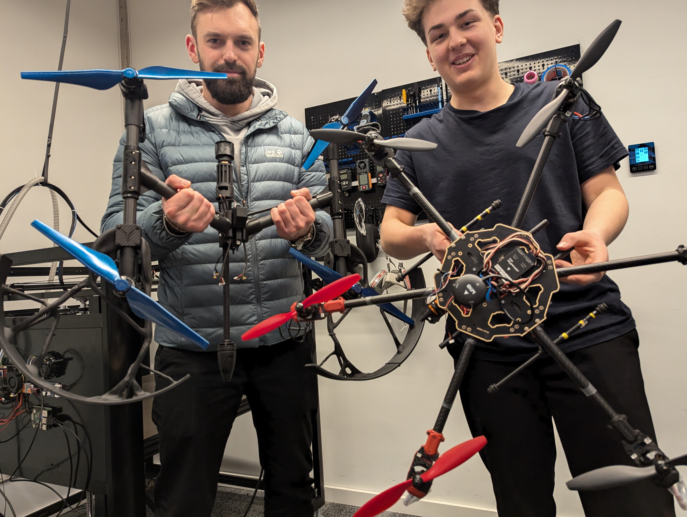

# The successor hexacopter

The first cleaning prototype used a modified quadcopter. Later development included a six-rotor layout with dedicated nozzle-mount and rotor-guard designs. This extended the mechanical work beyond adapting the original Inspire platform.

## Two physical platforms

*The modified quadcopter and a separate six-motor platform in the workshop, 23 February 2025.*

The six-motor build uses an exposed central plate, electronics, long arms and mixed red and dark propellers. The photograph shows it alongside the guarded Inspire-based aircraft. It establishes a physical development platform, separate from the later guarded CAD configuration.

The recorded building-cleaning flights belong to the Inspire-based prototype. This workshop photograph does not establish a flight or cleaning result for the six-motor platform.

## Bringing the parts into one assembly

The hexacopter model brings a central frame, six rotor positions, guards and landing legs into one layout. The guard structures combine outer ring sections with branching internal ribs around each rotor position.

The associated designs include a dedicated nozzle mount and rotor guard. Together, they continue the two main component workstreams from the earlier aircraft: carrying the cleaning equipment and integrating guards around the rotors.

| Fusion design | Last modified |
|---|---|
| `20021-000-01_frame-assembly` | 24 January 2025 |
| `20021-000-01_frame-assembly_v2` | 17 July 2025 |
| `Hexacopter_Nozzle_Mount_v2.2` | 17 July 2025 |
| `Hexacopter_Rotor_Guard_v1.0.0` | 16 July 2025 |

The dates describe the design files. The wider CAD work also includes revised arm clips and `Source_File_Hexacopter_Rotor_Guard_v1.1.0`.

## Connecting the design to the builds

The February workshop photographs and the later Fusion files document different stages of the six-rotor work. The photographed platform has exposed rotors; the later CAD branch adds the branching guard layout and a dedicated nozzle-mount design. The exact installation sequence between those states is not documented here.

The archive includes Tarot 680 frame references as well as custom attachments. The third-party base-frame files are excluded from this repository; custom component exports are documented separately. The original hexacopter guard studies remain a future addition, distinct from the recovered Inspire guard study described on the propeller-guard page.

See the [nozzle and hose](nozzle-and-hose.md) and [propeller-guard](propeller-guards.md) pages for the component development that preceded this layout.
